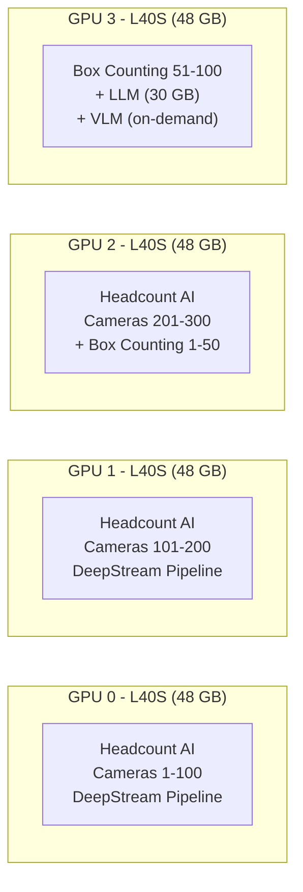
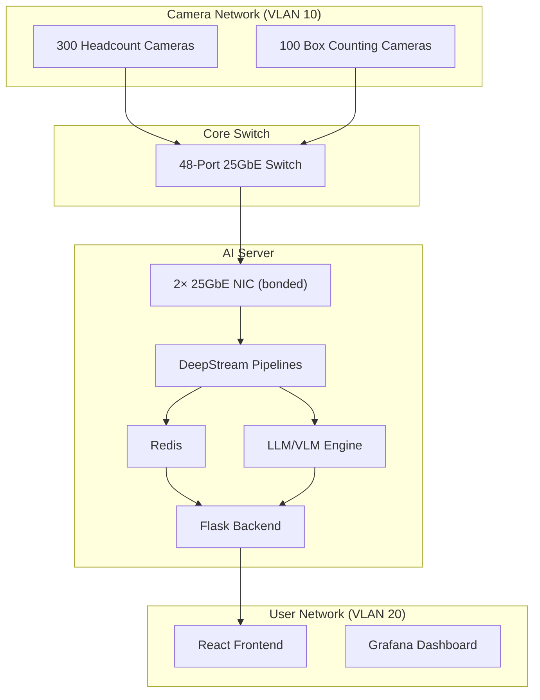

# Server Specifications — Multi-Workload AI Inference Server

## Workload Summary

| Workload | Cameras | Model | FPS Target | Est. GPU Load |
|---|---|---|---|---|
| **Headcount AI** (this project) | 300 | YOLOv26L + NvDCF Tracker | 15 FPS/cam | ~60% of total GPU |
| **Box Counting** (object detection) | 100 | YOLO-class detector | 15 FPS/cam | ~20% of total GPU |
| **LLM** (text intelligence) | — | Llama 3.1 70B / Qwen 72B class | On-demand | ~30 GB VRAM reserved |
| **VLM** (visual intelligence) | — | Llava-Next / Qwen2.5-VL 72B class | On-demand | ~40 GB VRAM reserved |

> [!IMPORTANT]
> This is an **enterprise-grade datacenter workload**. A single workstation GPU cannot handle this. You need multi-GPU or purpose-built AI servers.

---

## Recommended Configuration

### Option A — Single Server (Maximum Density)

This is the most cost-effective approach using NVIDIA's latest datacenter GPUs.

| Component | Specification | Rationale |
|---|---|---|
| **GPU** | **4× NVIDIA L40S (48 GB VRAM each)** | 192 GB total VRAM. Each L40S has 3 NVDEC engines (hardware decoders). 4 GPUs = 12 NVDEC = ~360 simultaneous H.264 decodes at 1080p. |
| **CPU** | **AMD EPYC 9554 (64-core)** or **Intel Xeon w9-3595X (60-core)** | 400 cameras generate ~6,000 frames/sec. CPU handles pre/post-processing, Redis I/O, REST APIs, and Python logic. |
| **RAM** | **256 GB DDR5 ECC (4800 MHz)** | Each camera stream buffer ≈ 50 MB. 400 streams × 50 MB = 20 GB baseline. LLM/VLM CPU offloading needs headroom. Redis caching adds ~10 GB. |
| **Storage** | **2 TB NVMe SSD (Gen4)** + **8 TB HDD** | NVMe for OS, Docker images, TensorRT engines, model weights. HDD for logs, recordings, face DB. |
| **Network** | **2× 25 GbE NIC** (bonded) | 400 cameras × 4 Mbps H.264 = 1.6 Gbps ingest. 25 GbE gives headroom for burst traffic and Redis replication. |
| **Power** | **2× 1600W PSU (redundant)** | 4× L40S = ~1,200W GPU alone. Total system draw ~1,800W. |

#### GPU Allocation Plan (4× L40S)



> [!TIP]
> The L40S is ideal because it has both strong inference AND hardware decode capability. The older A100 has no NVDEC at all and cannot decode RTSP streams.

---

### Option B — Dual Server (High Availability)

Splits the load for redundancy and easier maintenance.

#### Server 1: Video Analytics (DeepStream)

| Component | Specification |
|---|---|
| **GPU** | **2× NVIDIA L40S (48 GB each)** |
| **CPU** | **AMD EPYC 9354 (32-core)** |
| **RAM** | **128 GB DDR5 ECC** |
| **Storage** | **1 TB NVMe + 4 TB HDD** |
| **Workload** | All 400 cameras (300 headcount + 100 box counting) |

#### Server 2: AI Intelligence (LLM + VLM)

| Component | Specification |
|---|---|
| **GPU** | **2× NVIDIA A100 80 GB** or **2× NVIDIA H100 80 GB** |
| **CPU** | **AMD EPYC 9354 (32-core)** |
| **RAM** | **256 GB DDR5 ECC** |
| **Storage** | **2 TB NVMe** |
| **Workload** | LLM (70B params) + VLM (72B params) via vLLM/TGI |

> [!NOTE]
> Option B is preferred for production because:
> - Video analytics and LLM inference have different scaling patterns
> - You can upgrade/restart the LLM server without affecting camera feeds
> - Easier to troubleshoot and monitor

---

## Alternative GPU Options

| GPU | VRAM | NVDEC Engines | Max 1080p Streams | Price (approx.) | Best For |
|---|---|---|---|---|---|
| **NVIDIA L40S** | 48 GB | 3 | ~90 per GPU | $8,000 | ✅ Video + Inference (best balance) |
| **NVIDIA L40** | 48 GB | 3 | ~90 per GPU | $6,500 | Video + Inference (slightly slower) |
| **NVIDIA A30** | 24 GB | 4 | ~120 per GPU | $4,500 | Video-heavy (limited VRAM for LLM) |
| **NVIDIA RTX 6000 Ada** | 48 GB | 3 | ~90 per GPU | $6,800 | Workstation alternative to L40S |
| **NVIDIA H100** | 80 GB | 7 | ~210 per GPU | $25,000 | LLM/VLM only (overkill for video) |
| **NVIDIA A100** | 80 GB | 0 | ❌ | $15,000 | LLM only (NO hardware decode) |
| **NVIDIA T4** | 16 GB | 1 | ~30 per GPU | $2,000 | Budget option (need many) |

> [!WARNING]
> **Avoid A100/H100 for DeepStream video analytics** — they have zero or limited NVDEC hardware decoders. They're designed for training/LLM inference, not video processing.

---

## Software Stack

| Layer | Technology |
|---|---|
| **OS** | Ubuntu 22.04 LTS Server |
| **Container Runtime** | Docker + NVIDIA Container Toolkit |
| **Video Analytics** | NVIDIA DeepStream 9.0 SDK |
| **Model Format** | TensorRT FP16 engines |
| **LLM Serving** | vLLM or NVIDIA TensorRT-LLM |
| **VLM Serving** | vLLM with multimodal support |
| **Message Bus** | Redis 7.x (frame + detection data) |
| **Backend** | Flask / FastAPI (Python) |
| **Frontend** | React.js |
| **Monitoring** | Prometheus + Grafana + DCGM Exporter |

---

## Capacity Planning Formula

```
Cameras per GPU = (NVDEC_engines × 30) × (VRAM_GB / model_VRAM_GB)

Example for L40S with YOLOv26L:
  NVDEC = 3 engines × 30 streams = 90 decode capacity
  VRAM = 48 GB, YOLOv26L ≈ 0.15 GB = 320 inference slots
  Bottleneck = NVDEC (90 streams max per GPU at 1080p30)
  
At 15 FPS target: 90 × 2 = ~180 cameras per GPU
→ 2 GPUs handle 300 headcount cameras comfortably
→ 1 GPU handles 100 box counting cameras
→ 1 GPU for LLM + VLM
```

---

## Network Architecture



---

## Cost Estimate (Option A — Single Server)

| Component | Unit Cost | Qty | Total |
|---|---|---|---|
| NVIDIA L40S 48 GB | ~$8,000 | 4 | $32,000 |
| AMD EPYC 9554 64-core | ~$4,500 | 1 | $4,500 |
| 256 GB DDR5 ECC | ~$1,200 | 1 | $1,200 |
| 2 TB NVMe Gen4 | ~$200 | 1 | $200 |
| 8 TB HDD | ~$150 | 1 | $150 |
| 2× 25 GbE NIC | ~$500 | 1 | $500 |
| 4U Server Chassis + 1600W PSU | ~$2,000 | 1 | $2,000 |
| **Total** | | | **~$40,550** |

> [!CAUTION]
> These are approximate US retail prices. Enterprise/OEM pricing through Dell, HPE, or Supermicro may differ significantly. Factor in support contracts, rack space, cooling, and power costs.

---

## Recommended Pre-Built Server Options

| Vendor | Model | Config | Notes |
|---|---|---|---|
| **Dell** | PowerEdge R760xa | 4× L40S, EPYC 9554, 256 GB | Purpose-built for AI inference |
| **HPE** | ProLiant DL380a Gen11 | 4× L40S, Xeon, 256 GB | Enterprise support |
| **Supermicro** | SYS-421GE-TNRT | 4× GPU, EPYC, 256 GB | Best price/performance |
| **NVIDIA** | DGX Station A100 | 4× A100 80 GB | Premium but A100 has no NVDEC |
